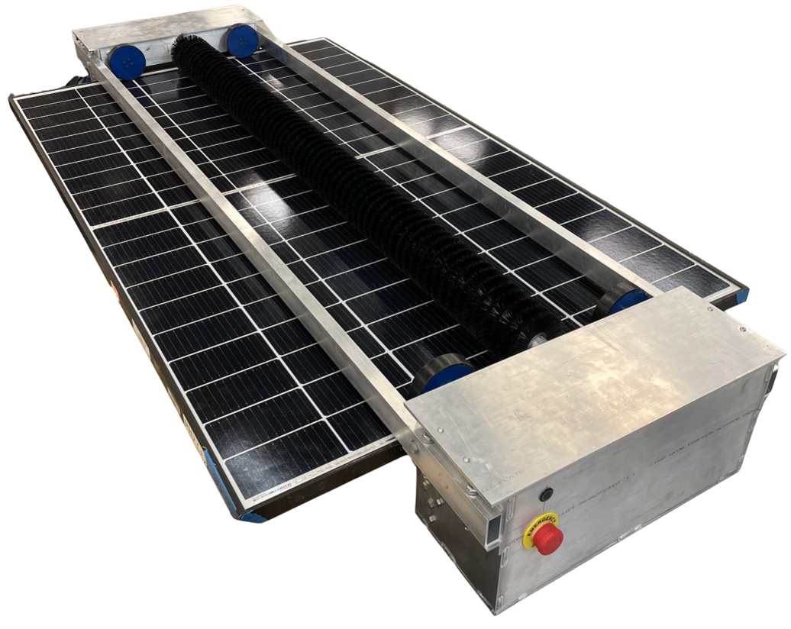
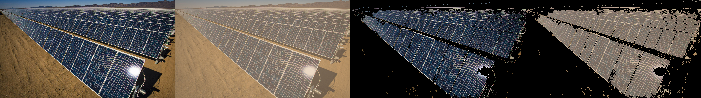

# Solar Panel Cleaning Robot
This is a senior design project worked on by Sam Crane (CpE), Tyler Pace (ME), Mateo Morales (ME), and Michael Griffin (ELET). It was done through the University of North Carolina at Charlotte from January - December 2023, and sponsored by EPRI. This robot was designed to clean a row of solar panels in a solar farm.

Completed Prototype

Robot Cleaning Panel

## Dependencies
The main dependencies are found in the requirements.txt. They can be installed to your python environment by going to a terminal and typing `pip install -r requirements.txt`. If you run this command and find that there are dependencies missing still, please update requirements.txt. I used Python 3.11 for developing this code, I can't guarantee it will work with other versions.

Important Notes: Install pyserial, not serial.

## crontab
Since this robot was being tested at the Senior Design Expo, we decided against having autonomous mode enabled at all. To do this, we decided against starting the script controlling the robot as soon as the Raspberry Pi got power (which would need to be implemented in the final version). To enable this feature, I would recommend using crontab. A tutorial can be found [here](https://www.raspberrypi.com/news/how-to-run-a-script-at-start-up-on-a-raspberry-pi-using-crontab/).

## Remote Controller
Useful Documentation on how to use [pyPS4 Library](https://pypi.org/project/pyPS4Controller/)

[Useful Documentation](https://salamwaddah.com/blog/connecting-ps4-controller-to-raspberry-pi-via-bluetooth#:~:text=On%20your%20Raspberry%20Pi%20top,start%20scanning%20nearby%20Bluetooth%20devices.&text=Done!,screen%20with%20your%20controller%20connected) on how to connect PS4 controller to RPi

## Vision Folder
Vision folder contains a script to identify the solar panel "contours" and one to identify the color within that shape.

Clean Image -> 'Dirty' Image -> Masked Clean Image -> Mask Applied to Dirty Image

## References
Please Note that files contained in the roboclaw_python folder are located at this repository: https://github.com/basicmicro/roboclaw_python_library/tree/master

Check out this website for a pinout of the Raspberry Pi: https://pinout.xyz